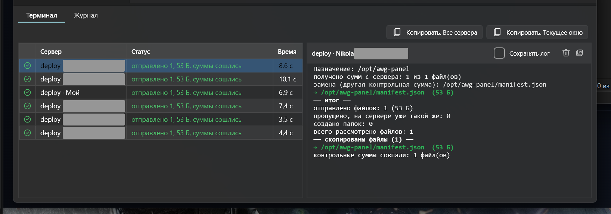
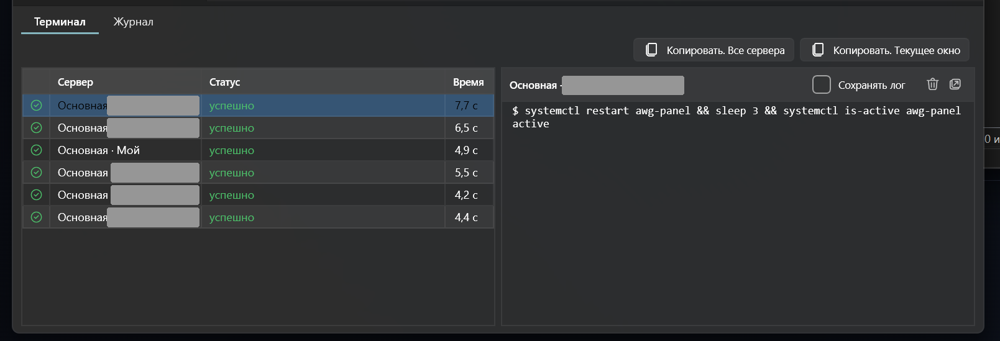

# MultiServerSync

**Files and commands on every server at once.**

Check the servers — and push files or run a command on all of them with one click. Every server reports back separately.

**English** · [Русский](README.ru.md)

Add your servers once. After that: check the ones you need, pick files or type a command, press **Run**.

- **Copy to every server** — files and folders go to the checked servers in parallel. A dropped connection never leaves a truncated file: each file is swapped in whole. Failed servers are retried in one click.
- **Only what changed** — compare by modification time or by SHA‑256: matching files aren't sent. Checksums can be verified again after copying.
- **Permissions, owner and date stay put** — a replaced file keeps its permissions and owner, a new one takes them from the folder it lands in. Modification time is carried over from the local file.
- **Commands and scripts** — a command or a multi‑line script of any length on every server at once, via sudo if you like. Favourite commands and history at hand.
- **Each server's output** — live, per server, with highlighting. A stuck command is interrupted with Ctrl+C or killed right from the app.
- **Tabs for different jobs** — each tab has its own servers, files, path and command. **Run everywhere** starts all tabs at once; the result shows on the tab labels.

## Get started

1. Unpack the [archive](https://byfox.dev/data/multiserversync/multiserversync.zip)
2. Run `MultiServerSync.exe`
3. Add your servers — and check where to send

Windows 10 / 11 (x64), requires [.NET 9 Desktop Runtime](https://dotnet.microsoft.com/download/dotnet/9.0). Freeware, no telemetry. This repository hosts the page and download links only.

---

Keywords: multi-server SSH, SFTP sync, deploy files to multiple servers, run a command on many servers, parallel SSH, Windows SSH tool.
