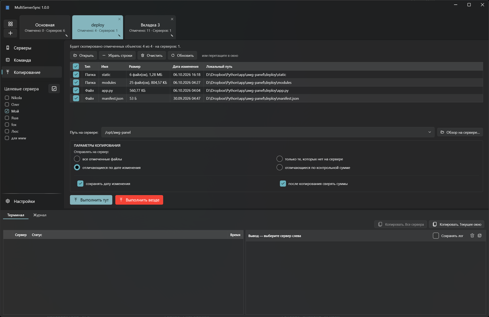
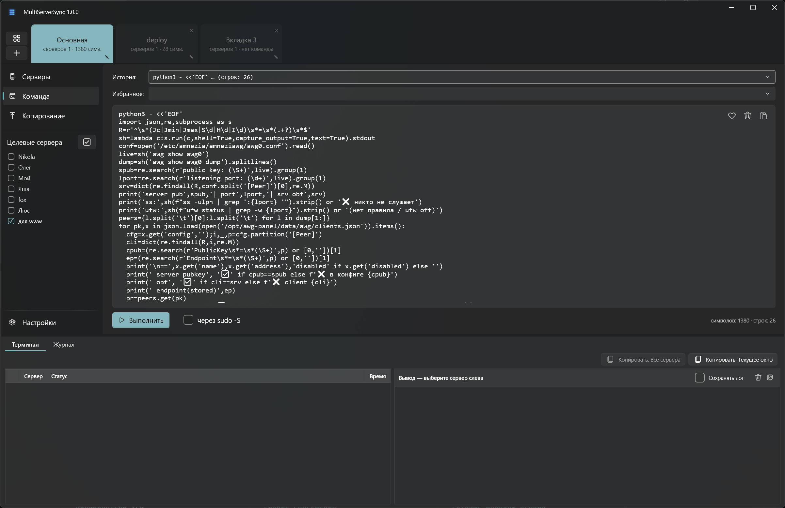
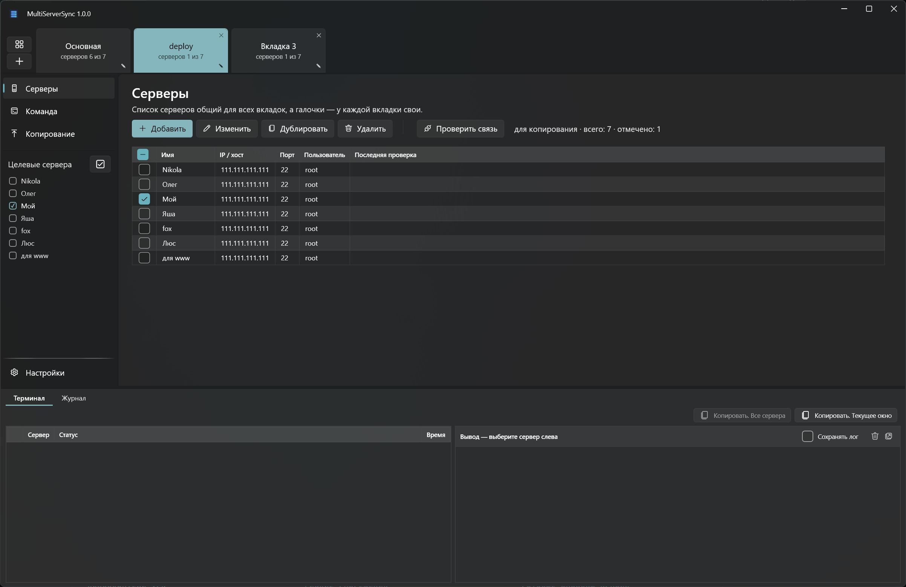
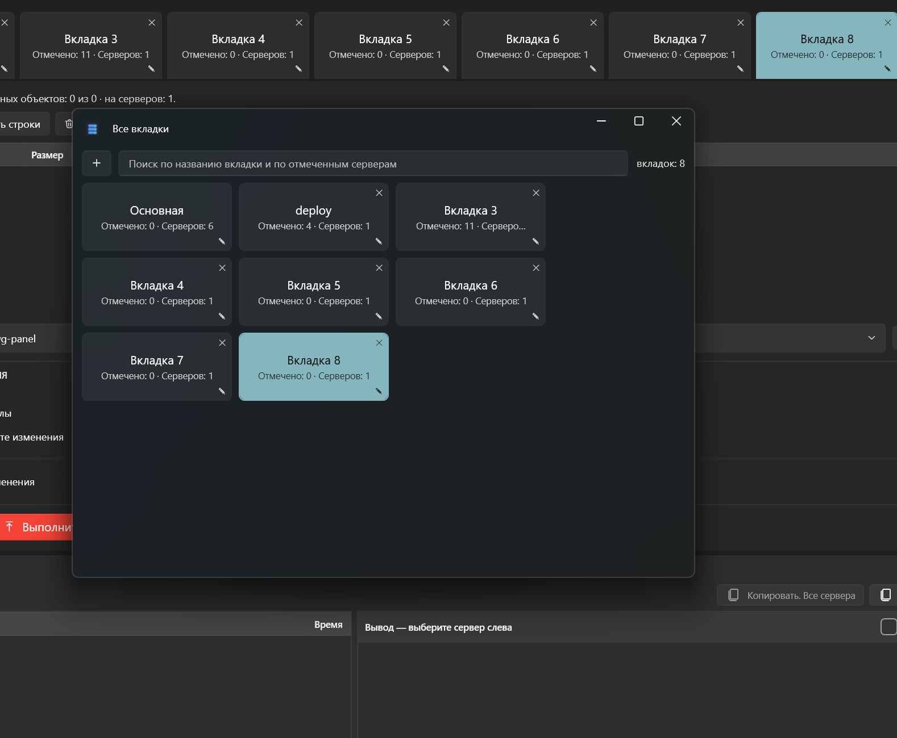

# MultiServerSync

**Файлы и команды на все серверы сразу.**

Отмечаете серверы — и одной кнопкой заливаете файлы или выполняете команду на всех. Каждый сервер отчитывается отдельно.

[English](README.md) · **Русский**

Серверы заводятся один раз. Дальше — отметили нужные, выбрали файлы или набрали команду и нажали **Выполнить**.

- **Копирование на все серверы** — файлы и папки уходят на отмеченные серверы параллельно. Обрыв связи не оставит обрезка — файл подменяется целиком. Упавшие серверы повторяются одной кнопкой.
- **Только изменённое** — сверка по дате или по контрольной сумме SHA-256: совпавшие файлы не отправляются. После копирования суммы можно сверить ещё раз.
- **Права, владелец и дата на месте** — заменённый файл сохраняет права и владельца, новый берёт их у папки, в которую ложится. Дата изменения переносится с локального файла.
- **Команды и скрипты** — команда или многострочный скрипт любой длины на всех серверах сразу, при желании через sudo. Избранные команды и история под рукой.
- **Вывод каждого сервера** — вживую и по каждому серверу отдельно, с подсветкой. Зависшую команду прерывают Ctrl+C или снимают прямо из программы.
- **Вкладки под задачи** — у каждой вкладки свои серверы, файлы, путь и команда. **Выполнить везде** запускает все вкладки разом, итог виден на ярлыках.

## Как начать

1. Распаковать [архив](https://byfox.dev/data/multiserversync/multiserversync.zip)
2. Запустить `MultiServerSync.exe`
3. Добавить серверы — и отметить, куда отправлять

Windows 10 / 11 (x64), нужен [.NET 9 Desktop Runtime](https://dotnet.microsoft.com/download/dotnet/9.0). Бесплатно, без телеметрии. В репозитории — только страница и ссылки на загрузку.

---

Ключевые слова: SSH на много серверов, синхронизация по SFTP, заливка файлов на несколько серверов, выполнение команды на всех серверах, параллельный SSH, SSH-утилита для Windows.
